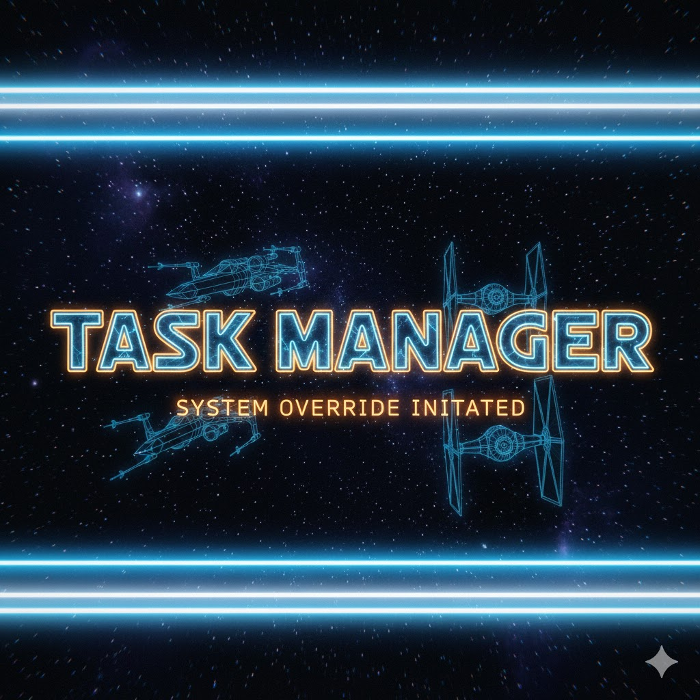
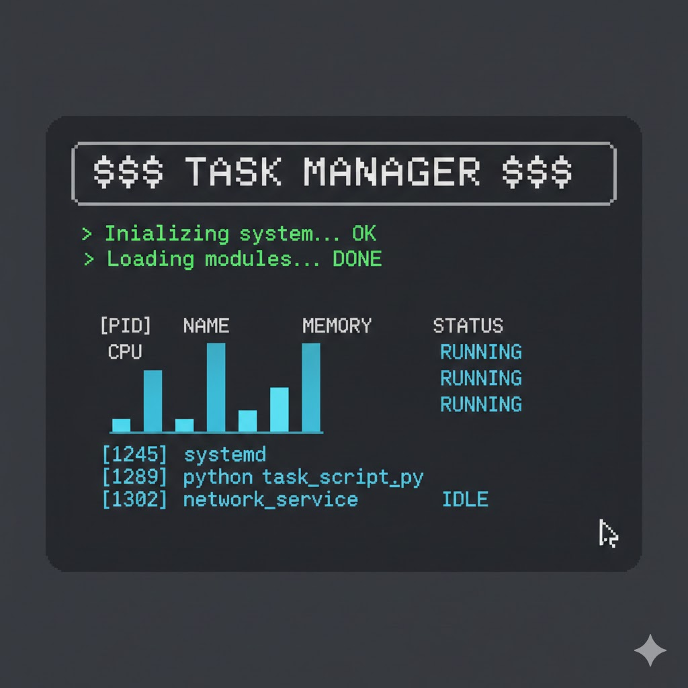

# TASK MANAGER
---

# 🖥️ **Advanced Python Task Manager – Web Dashboard V2**

### Real-Time Monitoring • WebSockets • Login • Gauges • Processes • Logs • CLI + GUI + Web

A complete **system monitoring suite** built in Python using:

* **Flask**
* **Flask-SocketIO**
* **psutil**
* **Chart.js**
* **WebSockets**
* **Tkinter / PyQt (optional GUIs)**

Includes the **simple version** AND the **full enterprise-grade version**.

---

# 📛 **Badges**


---

# 📚 **Table of Contents**

1. [Introduction](#introduction)
2. [Project Versions](#project-versions)
3. [Features](#features)
4. [Basic Version Code Overview](#basic-version)
5. [Advanced Web Dashboard V2](#advanced-version)
6. [Architecture](#architecture)
7. [ER Diagram](#er-diagram)
8. [Flow Diagram](#flow-diagram)
9. [Use Cases](#use-cases)
10. [Real-Life Applications](#real-life-examples)
11. [Pros & Cons](#pros--cons)
12. [Installation](#installation)
13. [How to Run](#how-to-run)
14. [Contribution Guide](#contribution)
15. [Support](#support)
16. [License](#license)

---

# 🧰 **Introduction**

This repository contains **two versions** of a Python task manager:

### ✅ 1. **Basic Version**

A simple CLI script using `psutil` to fetch CPU, RAM, and Disk usage.

### 🚀 2. **Advanced Task Manager Web Dashboard V2**

A professional monitoring dashboard featuring:

* WebSockets (real-time)
* Beautiful gauge UI
* Dark/Light theme
* Authentication
* Logs + Processes
* Network statistics
* GPU usage
* Modular architecture

---

# 📦 **Project Versions**

| Version                       | Description                         | Location                  |
| ----------------------------- | ----------------------------------- | ------------------------- |
| **Basic Task Manager**        | Lightweight system resource monitor | `basic_task_manager.py`   |
| **Advanced Web Dashboard V2** | Full Web Monitoring Suite           | `web-dashboard-v2/`       |
| **Tkinter GUI**               | Desktop GUI                         | `task_manager_tkinter.py` |
| **PyQt GUI**                  | Modern GUI                          | `task_manager_pyqt.py`    |

---

# ✨ **Features**

### 🔰 Basic Version

* CPU usage
* RAM usage
* Disk usage
* Simple CLI output

### 🚀 Advanced Version

* Real-time **WebSocket** updates (1/sec)
* Stylish **gauge meters**
* Top CPU processes table
* System logs panel
* Network monitoring
* GPU (NVIDIA) monitoring
* Login authentication
* Session-based theme toggle (dark/light)
* REST API (theme)
* Export logs (optional)
* Fully responsive HTML dashboard

---

# 🧾 **Basic Version**

```python
import psutil

def get_system_resources():
    cpu_usage = psutil.cpu_percent(interval=1)
    
    mem = psutil.virtual_memory()
    mem_used = mem.used / (1024**3)
    mem_tot = mem.total / (1024**3)
    
    stats = {
        "CPU" : f"{cpu_usage}%",
        "Memory" : f"{mem_used:.2f} / {mem_tot:.2f} GB"
    }
    
    for partition in psutil.disk_partitions():
        try:
            usage = psutil.disk_usage(partition.mountpoint)
            used_gb = usage.used / (1024**3)
            total_gb = usage.total / (1024**3)
            stats[f"Disk ({partition.mountpoint})"] = (
                f"{used_gb:.2f} / {total_gb:.2f} GB"
            )
        except PermissionError:
            continue
    
    return stats

resource = get_system_resources()
for name, usage in resource.items():
    print(f"{name} : {usage}")
```

---




---
# 🚀 **Advanced Version**

### 🔥 Web Dashboard V2 Features:

* Real-time **WebSocket** pushing
* Flask server
* Authentication system
* Gauges (CPU / RAM / Disk / GPU)
* Dark/Light themes
* Process manager
* Logging terminal
* Full web UI

Folder structure:

```
web-dashboard-v2/
│── app.py
│── templates/
│── static/
│── requirements.txt
```

---

# 🏗️ **Architecture**

```
┌─────────────────────────────────────────┐
│               User Browser              │
│ ┌─────────────┐   WebSocket   ┌────────┐│
│ │ dashboard.js│◀──────────────▶SocketIO││
│ └──────┬──────┘                └────────┘│
└────────┼──────────────────────────────────┘
         │ Flask REST / Static
┌────────▼────────┐
│    Flask App     │
│  Authentication   │
│  Routing API      │
│  Theme Control    │
└────────┬─────────┘
         │ calls
┌────────▼─────────┐
│   System Layer    │
│    (psutil)       │
│ CPU/RAM/Disk/GPU  │
│ Process Manager   │
└───────────────────┘
```

---

# 🗂️ **ER Diagram**

```
┌────────────┐
│   Users    │
│────────────│
│ id         │
│ username   │
│ password   │
│ theme      │
└────────────┘
       ▲
       │ session
       │
┌────────────┐
│  Sessions  │
│────────────│
│ user_id    │
│ timestamp  │
└────────────┘
```

---

# 🔄 **Flow Diagram**

```
[User] 
   │
   ▼
[Login Page] ──incorrect──> [Error]
   │correct
   ▼
[Dashboard.html]
   │
   ▼ WebSocket
[SocketIO Server] 
   │ polls every sec
   ▼
[get_system_data()]
   │
   ▼
[psutil → CPU/RAM/Disk/Processes/GPU]
   │
   ▼ send JSON
[Browser UI Updates]
```

---

# 📌 **Use Cases**

| Use Case          | Description                     |
| ----------------- | ------------------------------- |
| System Monitoring | Watch CPU/RAM/Disk live         |
| Server Dashboard  | Deploy on server and monitor    |
| Education         | Learn psutil, WebSockets, Flask |
| Diagnostics       | Debug performance problems      |
| GUI Development   | Tkinter / PyQt practice         |

---

# 🌍 **Real-Life Examples**

* Monitoring a **local PC**
* Monitoring **Docker containers**
* Monitoring a **Raspberry Pi home server**
* Monitoring **GPU workloads** (AI training)
* Real-time dashboard in **NOC rooms**
* Teaching students about system internals

---

# ⚖️ **Pros & Cons**

### ✅ Pros

* Real-time updates
* Clean UI
* Uses standard Python libraries
* Cross-platform
* Web-based (access from anywhere)

### ❌ Cons

* Requires Python installation
* Must be run manually
* WebSocket requires open port
* Not a replacement for full NOC tools (like Grafana)

---

# ⚙️ **Installation**

```bash
git clone https://github.com/alok-kumar8765/task-manager
cd web-dashboard-v2
pip install -r requirements.txt
```

---

# ▶️ **How to Run**

### For the advanced dashboard:

```bash
python app.py
```

Open:

```
http://127.0.0.1:5000
```

### For basic version:

```bash
python task_manager.py
```

---

# 🤝 **Contribution**

### Steps:

1. **Fork** repo
2. Create a new branch
3. Add changes
4. Submit **Pull Request**

```bash
git pull
git add .
git commit -m "Enhanced dashboard"
git push
```

---

# ⭐ **Support**

If you like the project:

🌟 **Star the repository**
🍴 **Fork it**
🐛 **Report issues**
💬 **Request features**

---

# 📜 **License**

MIT License — free to use for personal and commercial projects.

---

